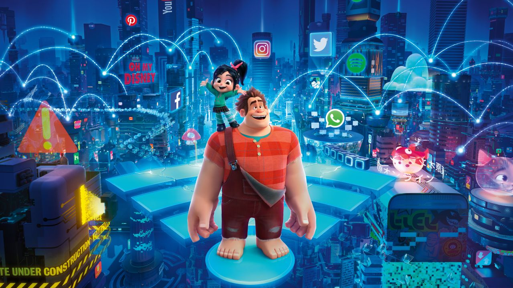
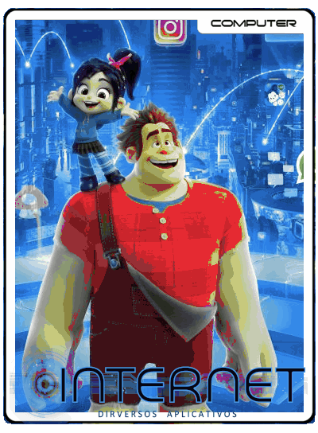
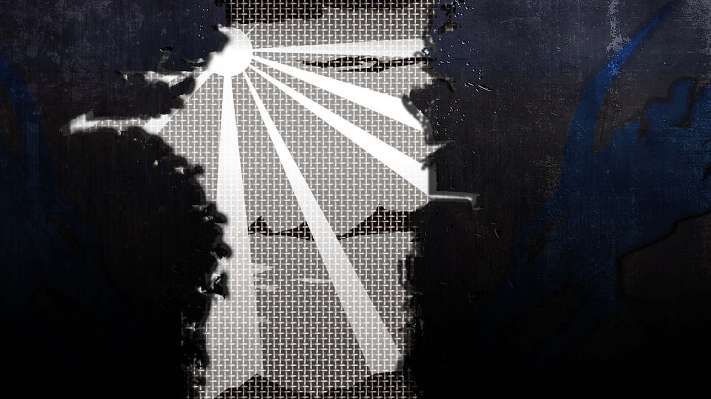
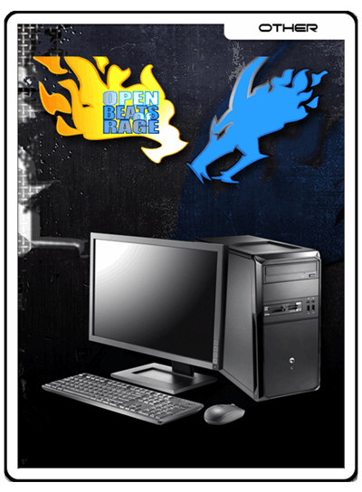
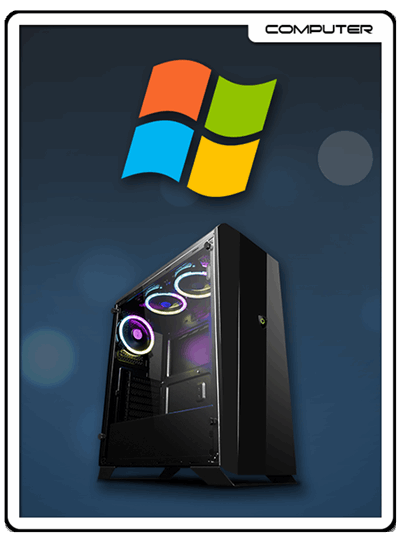

# UniFlyered tem como base os temas NEON Hursty

#####################################################################################

OVERVIEW

This UniFlyered theme is to be used within Emulation Station.

This is an Emulation Station theme is was developed specifically for the Waveshare GameHAT portable RetroPie handheld console.

If using this theme on a GameHAT, please set the screen ration to 16:9.

It is created for the 3:2 screen resolution although it should be able to be used with other small screen resolutions as well.

NOTE

You do not always have to put Emulation Station themes in the standard /etc/emulationstation/themes location.

Emulation Station provides additional support for placing them into a different folder. The benefit of using this different folder is that the default user "pi" has full read/write access. You no longer have to be user "root" to copy over files or swap out files.

By default, this new "themes" folder does not exist, so simply create it.

/opt/retropie/configs/all/emulationstation/themes

NOTE You can also access this same folder by navigating this hidden folder

/home/pi/.emulationstation

Hursty

# Screenshots

#####################################################################################
Algumas *pastas e menus adicionados/modificados por Sergio Graças*, porém todos os créditos são dos criadores originais do tema *Husty* e aproveito para agradecer a boa vontade em construir um tema e disponibilizar que outras pessoas possam usar
#####################################################################################
